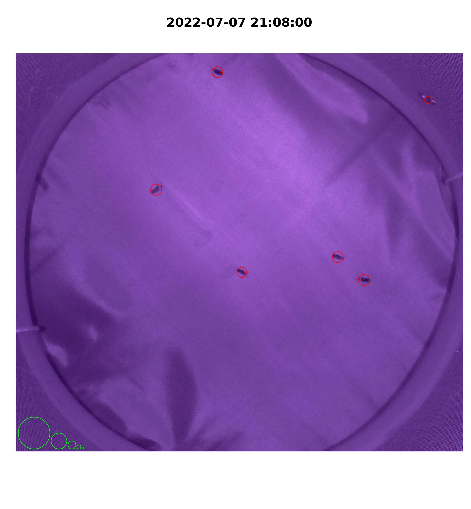

# Description

Historically, most insect chronoecological research has used direct observations, cameras, and/or infrared beam-based monitors to quantify movement across timed intervals. Although many systems are cheaper than the traditional infrared locomotor activity monitors (e.g., DAM/LAM), these options can remain complicated to build, computationally intensive to setup/process, and/or unable to accommodate large-bodied insects (i.e., not *Drosophila*).

To fill this gap, we developed the affordable, **imaging Locomotor Activity Monitor (iLAM)** for activity quantification. The iLAM utilizes a [Raspberry Pi Zero W](https://www.raspberrypi.com/products/raspberry-pi-zero-w/) computer and night-vision camera inside a flight cage to regularly photograph a population of insects at user-defined intervals.

Customizable, modular R-scripts process consecutive images with [*imager*](https://cran.r-project.org/web/packages/imager/) and output a file containing the *number*, *size*, *location*, and *timing* of all identified movements. Movement data can be converted into DAM format or directly analyzed within the [*Rethomics*](https://rethomics.github.io/) framework.

Out-of-the-box functions can be downloaded and installed from our [iLAMtools](https://github.com/daytonjn/iLAMtools) repository.

```{r x, fig.cap='iLAM Workflow', echo=FALSE, fig.show='hold',fig.align='center'}
knitr::include_graphics("images/ilam_workflow.png", error=FALSE)
```

```{r v, fig.cap='Representative firefly movements identified by iLAM system',echo=FALSE, fig.show='hold',fig.align='center'}
knitr::include_graphics("images/ilam_photinus.gif", error=FALSE)
```

This resource provides detailed instructions for (1) iLAM construction, (2) Raspberry Pi setup, (3) Image analysis in R, (4) conversion of iLAM output to DAM format in R, and (5) Sample results using Rethomics.

<!--chapter:end:index.Rmd-->

# Flight Cage Construction

The paired iLAM flight cages described in our original publication used the following materials:

```{r y, fig.cap='iLAM Materials', echo=FALSE, quiet=TRUE, warning=FALSE}
library(knitr)
library(readr)

materials_ilam <- read_csv("data/materials_ilam.csv", 
    col_types = cols(`Units/Setup` = col_character()))

knitr::kable(materials_ilam, error=FALSE, caption = "iLAM materials")

```

*All materials were purchased from local hardware stores, art supply chains, Raspberry Pi suppliers, and Amazon*

The three cage levels were made with the following cuts:

-   Top: 31 1/2" x 10 1/2"
    -   Two Circles: 13 3/8" diameter (\<14" hoop)
-   Bottom: 31 1/2" x 10 1/2"
    -   Two Circles: 7 1/2" diameter (\<8" hoop)
    -   Hole for camera ribbon
-   Base: 31 1/2" x 10 1/2"

```{r z, fig.cap='iLAM flight cage: front view', echo=FALSE, fig.show='hold',fig.align='left'}
knitr::include_graphics("images/ilam_in_triangle.jpg")
```

```{r a, fig.cap='iLAM flight cage: top-down view', echo=FALSE, fig.show='hold',fig.align='left'}
knitr::include_graphics("images/ilam_interior.jpg")
```

**Tips:**

-   To increase the lifespan of experimental insects and the experiment's recording duration, add cups with moist sponges and a falcon tube with a cotton roll and water (held by Velcro)
-   To prevent escape by small experimental insects (e.g., *Photinus* species), add duct-tape around the camera ribbon cable hole and camera
-   Depending on the color that the study insect appears under infrared light (i.e., white vs. black appearance), change the background of the lid to maximize contrast
-   To minimize differences in the photographed light environment throughout light:dark/dark:light transitions, we now:
    -   Cover the Raspberry Pi's light sensors with black duct tape or plastic; this "tricks" the Pi to keep it's infrared lights on 24/7
    -   Cover the Raspberry Pi's camera lens with a [narrow longpass filter](https://www.edmundoptics.com/p/780nm-127mm-dia-colored-glass-replacement-longpass-filter/43186/) that only permits infrared light to the camera

<!--chapter:end:01-construction.Rmd-->

---
editor_options: 
  markdown: 
---

# Raspberry Pi Zero w/Camera Setup

Steps to program the Raspberry Pi Zero computers to capture and store images:

**1. Obtain necessary cables/connectors:**

-   USB 2.0 to microSD card reader (to image SD card on a PC)
-   USB 2.0 microUSB male to USB female adapter (to connect keyboard with Pi)
-   Keyboard with USB 2.0 wire
-   Micro HDMI male to HDMI female adapter & HDMI cable (to connect monitor with Pi) or micro HDMI to HDMI cable

**2. Install operating system:**

```{r aa, fig.cap='Raspberry Pi Imager', echo=FALSE, fig.show='hold',fig.align='left'}
knitr::include_graphics("images/raspberry_pi_imager.png")
```

-   Use microSD card reader to mount SD card onto a PC
-   Download and open [Raspberry Pi Imager](https://www.raspberrypi.com/software/)
    -   Choose OS → Raspberry Pi OS (Other) → Raspberry Pi OS Lite (32-bit)
    -   Choose Storage → *Drive referring to microSD card*
    -   *Optional*: Gears →
        -   Set hostname (*name of the pi on your wifi network that you ssh [pi_name]\@[IP Address] into*)
        -   Enable ssh
        -   Set username and password (*user login information to access the pi*)
        -   Set locale settings (*e.g., America/New York & us*)
    -   Write
-   Disconnect and insert formatted microSD card into Pi
-   Connect Pi to keyboard, monitor, and power source
-   Once connected to power, Pi automatically turns on

**2. Login with default or already specified login information:**

-   raspberrypi login: pi
-   password: raspberry

**3. Configure Pi settings:** `sudo raspi-config`

-   Use arrow keys and Enter to navigate
-   1 → S1 Connect to wifi
    -   SSID: wifi network name
    -   Passphrase: wifi password
-   1 → S3 change pi password
-   1 → S4 change pi name (not login)
-   3 → I1 enable camera attachment
-   3 → I2 enable remote access (`ssh`)
-   5 → L2 set timezone
-   Finish (type `y` when asked if you want to reboot)

**4. Add static IP address for remote access:** <https://raspberrypi-guide.github.io/networking/set-up-static-ip-address>

**5. Continue programming directly or remotely access the Pi through terminal from another PC:**

```         
ssh login_name@[IP address]
password:
```

**6. Make a folder/directory named 'still' to hold images:** `mkdir still_[xxx]`

-   *Note: [xxx] refers to the login name of the Raspberry Pi associated with the iLAM*

**7. Make a directory named script to hold scripts:** `mkdir script_[xxx]`

**8. Write a script using a text-editor (e.g., nano) named still\_[xxx].sh:** `sudo nano ./script_[xxx]/still_[xxx].sh` and write the following text:

```         
#!/bin/bash
DATE=$(date +"%m%d.%H%M")
sudo raspistill -o /home/$USER/still_$USER/$USER.$DATE.jpg
```

-   This script will take images and save them along w/ metadata into the still\_\$USER directory:
    -   (Line 1) necessary for any bash file with instructions
    -   (Line 2) sets the format for the date and time in the file name
    -   (Line 3) command for pi to take a photo and store it with specified file name/location.
-   Hit `control^X` to exit (type `y` when asked if you want to save)

**9. To automatically upload/copy images into a remote directory, you may (A) use scp to upload each image after it's taken, or (b) mount a remote directory and then copy each image.**

-   `ssh-keygen` and `ENTER` to generate a new SSH key to enable a custom script to automatically upload images without requiring a password input

-   `ssh-copy-id -i ~/.ssh/id_rsa [remote_PC_hostname]@[remote_PC IP address]`

-   Input password for remote_PC

-   Option A: Add the following line to the end of still\_[xxx].sh:

``` bash
scp /home/$USER/still_$USER/$USER.$DATE.jpg [remote_PC_hostname]@[remote_PC IP address]:[directory that you want images saved into]/
```

-   Option B: Add the following lines to the end of still\_[xxx].sh:

``` bash
sleep 10
scp /home/$USER/still_$USER/$USER.$DATE.jpg /home/$USER/mount_$USER/
```

**10. Schedule the imaging script to run periodically with crontab:**

-   Access the crontab file

```         
sudo crontab -e
```

-   Select the first option to edit the crontab in nano
-   Copy the following to the bottom of the file:

``` bash
*/2 *  *   *   * sh /home/$USER/script_$USER/still_$USER.sh 2>&1
```

-   This tells the pi to execute the still.sh file every 2 minutes (the order is minute, hour, day of month, month, day of week). When setting up a new crontab, always run it past [*crontab.guru*](https://crontab.guru/)!

-   `control^X` to exit (type y when asked if you want to save)

**11. Access Raspberry Pi image files on your PC:**

-   Even if your iLAM/Pi is programmed to upload files to a remote computer over Wifi, at the end of every experiment, we recommend verifying that all images were properly uploaded/transferred. To remotely download images, you may:

-   Option A: Download images via Command line

    -   Log in to the Linux/Powershell on your laptop

        ``` bash
        scp pi@[IP address]:~/still_[xxx]/*.jpg ~/[target directory]`
        ```

-   Option B: Download images via a free file transfer program (FTP) like [FileZilla](https://filezilla-project.org/)

    -   Open FileZilla: In *Site Manager*, choose *New site*

    -   Protocol: SFTP - SSH File Transfer Protocol

    -   Host: [IP Address of Raspberry Pi]

    -   Logon Type: *Normal*

    -   User: [Pi login name]

    -   Password: [Pi login password]

    -   Connect

**Trouble-shooting**

-raspistill will not take a picture and returns\*\* `*failed to open vchiq instance`:

1.  Verify that the camera is connected and the ribbon cable is not damaged:

    ``` bash
    vcgencmd get_camera
    ```

2.  Determine if the camera or the still\_[xxx].sh script is the issue:

    ``` bash
    raspistill -o /home/$USER/test.jpg
    ```

3.  Modify permissions of the camera: `sudo chmod777 /dev/vchiq`

A Linux reader is required to read the Raspian imaged SD card, when plugged into a Windows PC. [Linux Reader](https://www.diskinternals.com/linux-reader/) is a free option. Instructions can be found [here](https://raspberrytips.com/read-raspberry-pi-sd-card-windows/).

**Tips:**

-   Useful Linux commands:

    -   \* wildcard (e.g. `*.jpg` == all jpeg files)
    -   `control^A` bring cursor to beginning of line
    -   `control^E` bring cursor to end of line
    -   `control^C` kill process
    -   `clear` clear all previous text from terminal
    -   `ls` list all contents in current folder
    -   `cd directory_path` change to named folder
    -   `cd ~` go to home directory
    -   `cd ..` go up one folder level
    -   `cd -` go back to last folder
    -   `mkdir dir_name` create EMPTY folder (directory)
    -   `rmdir dir_name` remove EMPTY folder
    -   `rm file_name` remove a file
    -   `rm -f file_name` remove a file without asking for permission
    -   `rm -r dir_name` recursively remove all files from folder
    -   `rm -rf dir_name` forcefully remove all files from folder
    -   `ren name_1 name_2` rename something to something else
    -   `cp file_1 file_2` copy file_1 to file_2, creates duplicate. *note*: if file_2 exists will overwrite (NO warning)
    -   `cp -r dir_1 dir_2` copy folder and its contents
    -   `nano file_name` make named file and open text editor
    -   `sudo reboot      reboot pi`
    -   `sudo shutdown now` safely shutdown pi (reboots when plugged in again)

<!--chapter:end:02-rpi_setup.Rmd-->

# Post-Process Image Segmentation

Below is a walk-through for the post-process image segmentation (i.e., blob identification) of iLAM images to identify movements

**1. Organize your file directory structure in a logical, hierarchical structure**

-   `~/iLAM/exp_a/` contains images, metadata, and analysis scripts specific to Experiment A
-   Experiment A's images from ilam_01 and ilam_02 are saved in `~/iLAM/exp_a/ilam_01/` and `~/iLAM/exp_a/ilam_02/`, respectively
-   .CSV output containing the size, location, and timing of all blobs/movements for each iLAM cages for Experiment A (i.e., ilam_01 and ilam_02):`~/iLAM/exp_a/iLAM_exp_a.txt/`, with corresponding metadata: `~/iLAM/exp_a/metadata_exp_a.csv/`

```{r, fig.cap='Directory structure for iLAM analysis', echo=FALSE}

library(data.tree)

path <- c(
    "iLAM/exp_a/ilam01/ilam01.0707.2058.jpg",
    "iLAM/exp_a/ilam01/ilam01.0707.2100.jpg",
    
    "iLAM/exp_a/ilam02/ilam02.0707.2058.jpg",
    "iLAM/exp_a/ilam02/ilam02.0707.2100.jpg",
    
    "iLAM/exp_a/scripts/analyze_experiment.R",
    "iLAM/exp_a/scripts/exp_a_ilam01.R",
    "iLAM/exp_a/scripts/exp_a_ilam02.R",

    "iLAM/exp_a/scripts/run_exp_a_ilam01.sh",
    "iLAM/exp_a/scripts/run_exp_a_ilam02.sh",

    "iLAM/exp_a/metadata_exp_a.csv",
    "iLAM/exp_a/iLAM_exp_a.txt",
    
    "iLAM/exp_b/ilam01/",
    "iLAM/exp_b/ilam02/",
    "iLAM/exp_b/scripts/",
    
    "iLAM/scripts/add_columns_to_42.R",
    "iLAM/scripts/find_movements.R",
    "iLAM/scripts/find_threshold.R", 
    "iLAM/scripts/make_dam_file.R", 
    "iLAM/scripts/make_gif.R", 
    "iLAM/scripts/parse_movements.R", 
    "iLAM/scripts/plot_movements.R"
)

mytree <- data.tree::as.Node(data.frame(pathString = path))
print(mytree)
```

**2. Install** [iLAMtools](https://github.com/daytonjn/iLAMtools) **from GitHub**

``` r
library(devtools)
devtools::install_github("daytonjn/iLAMtools", force=TRUE)
library(iLAMtools)
```

Alternatively, you can download iLAM functions from this zip folder: `r {xfun::embed_dir("./ilam_scripts/", text='iLAM wrapper functions')}` and reference them with 'source()'.

To verify installation, a set of sample images and script can be downloaded from this zip folder (198MB): `r {xfun::embed_dir("./ilam_test/", text='iLAM test workflow')}`.

**2. Perform image segmentation to identify movements across images taken by each iLAM (exp_a_ilam01.R, exp_a_ilam02.R, etc.)**

```{r bb, fig.cap='Image segmentation workflow', echo=FALSE, fig.show='hold',fig.align='left'}
knitr::include_graphics("images/segmentation_workflow.png")
```

-   Load required packages and iLAM functions

```         
setwd("/~/iLAM/exp_a/")
library(iLAMtools)
```

-   Update and tailor values for every cage and/or experiment; these values are recorded to metadata output and used as input settings for the *find_movements()* iLAM wrapper function:
    -   **Cage-Specific:** Integer coordinates for image cropping (x_left, x_right, y_bot, y_top)
    -   **Experiment-Specific:**
        -   *n_thr:* Numeric threshold percentile; higher values indicate a more stringent filtering. e.g., at n_thr=0.999, only the darkest pixel differences \>99.9% are retained for blob identification (default: n_thr = 0.996)
            -   Note: For moths (*O. nubilalis*, *H. zea*, *S. frugiperda*), we use: n_thr=0.999
            -   Note: For beetles (*Photinus* species, *H. axyridus*), we use: n_thr=0.999
        -   *n_cln:* Integer value to clean up pixels: e.g., at n_cln = 5, this first "shrinks" to remove all isolated blobs smaller than 5 pixels, and then "grows" remaining blobs by 5\*n_grw pixels to aggregate nearby blobs with each other. (default: n_cln = 5, n_grw = 1.5)
            -   Note: For moths (*O. nubilalis*, *H. zea*, *S. frugiperda*), we use: n_cln=10, n_grw=1.5
            -   Note: For beetles (*Photinus* species, *H. axyridus*), we use: n_cln=10, n_grw=1.5
        -   *genus:* Character string for study organism
        -   *species:* Character string for study organism
        -   *color:* Character string to indicate whether the study organism appears "white" or "black" on the background
            -   Note: For moths (*O. nubilalis*, *H. zea*, *S. frugiperda*), we use: "white"
            -   Note: For beetles (*Photinus* species), we use: "black"
        -   For more information on threshold, clean, blur, etc., see [imager documentation](https://dahtah.github.io/imager/) for more details.

```         
pi_sub_folder <- "ilam01"
sex <- "male" #cage/project-specific

#Crop-settings
x_left <- 425 #cage-specific, depending on camera arrangement
x_right <- 2225 #cage-specific, depending on camera arrangement
y_bot <- 100 #cage-specific, depending on camera arrangement
y_top <- 1700 #cage-specific, depending on camera arrangement

#change following values for every experiment
out_file_name = "iLAM_exp_a" #project-specific
n_thr = 0.999 #species-specific, depending on IR reflectance/contrast with background
n_cln = 10 #species-specific, depending on IR reflectance
n_max = 75000 #species-specific, pixel differences above this value will be considered as noise
start_photophase = 5 #project-specific, time that lights turn on
end_photophase = 21 #project-specific, time that dark starts
genus = "photinus" #project-specific
species = "marginellus" #project-specific
animal = "black" #project-specific, during the night, does the animal appear "white" on a dark background or "black" on a light background? This is VERY important (!) because it determines whether "movements" identify insects whom left vs. arrived between frames 
```

-   Create a vector of .jpg image file names to be analyzed

```         
file_names <- list.files(pi_sub_folder,
                         pattern= "*.jpg",
                         full.names = TRUE)
```

We identify cropping locations that remove the outer edges of the cage, and maintain a constant picture area across all iLAMs (e.g., 1800x1600 pixels) with the following command:

```         
load.image(file_names[1]) %>%
imsub(x %inr% c(x_left,x_right), y %inr% c(y_bot,y_top)) %>% plot()
```

-   Find all movements by image subtraction, global thresholding, and blob detection in the iLAM wrapper function `find_movements()`.

    -Additional *optional* settings:

    -   *n_blr:* Integer value to set blur radius to denoise image and reduce graininess, prior to image subtraction (default: n_blr = 3)
    -   *n_grw:* Integer value for n_cln multiplier to "grow" and aggregate blobs within a given proximity. For example, when n_cln=5 and n_grw = 1.5, blobs are first shrunk by 5 pixels and then grown by 5x1.5=7.5 pixels (default: n_grw = 1.5)
    -   *n_max:* Integer value denoting the maximum number of pixel differences expected between two images; any values above this n_max will be considered as noisy and assigned an arbitrary value for subsequent filtering/removal. See \@ref(04-make_dam_output.Rmd) for more information. Example, if a moth movement = 3000 pixels and there are five moths in a cage, then the maximum number of differences expected is 15,000 pixels. (default: n_max = 75000)
    -   *find_thr:* Boolean value "T" (true) or "F" (false) to determine what pixel value cut-off corresponds to the n_thr percentile difference across a p_sample of image comparisons (default = "T")
    -   *type_thr:* String value "absolute" or "relative" indicating whether to perform absolute (capture all differences \> n_thr for all pictures) or relative thresholding procedure (capture all differences \> n_thr for each comparison) on set of images. We recommend the default, "absolute" option because the latter identifies false movements in images where there are no movements because it always retains the top pixel differences. (default: find_thr = "absolute")
    -   *p_sample:* Numeric value denoting the proportion of image comparisons that should be used to determine the absolute threshold value
        -   Note: If 5% of the total images is \<100, then increasing p_sample \>0.05 is recommended
    -   *channel:* String value denoting which color channel movements should be identified from (default: "grayscale")

```         
out <- find_movements(files = file_names, # list of file names 
                      n_thr = n_thr,      # threshold value (0.992 == "0.8%")
                      n_cln = n_cln,      # value for cleaning (number of pixels)
                      n_grw = 1.5,      # multiplier for n_cln (shrink vs. grow)
                      n_blr = 3,          # let user select blur radius
                      n_max = 75000,      # upper cut-off for # pixel differences
                      x_left = x_left,    # value for crop on x min
                      x_right = x_right,  # value for crop on x max
                      y_bot = y_bot,      # value for crop on y min
                      y_top = y_top,      # value for crop on y max
                      find_thr = T, # T or F
                      type_thr = "absolute",
                      p_sample = 0.05,    # If 5% of the total images < 100, then increase this value
                      channel = "grayscale",
                      animal = animal)
```

-   Update and save output containing all identified blobs, their size and location as a .csv in the current working directory.

```         
#adds additional columns to dataframe
out$ID <- paste0(n_thr*100,"%_", "s", n_cln, "g", 1.5*n_cln)
out$sex <- sex
out$genus <- genus
out$species <- species

if (file.exists(paste0(out_file_name,".csv"))){
  write.table(out, file = paste0(out_file_name,".csv"),
              append = TRUE, quote = TRUE, sep = ",",
              row.names = FALSE, col.names = FALSE)
} else{
  write.csv(out, file = paste0(out_file_name,".csv"),
            col.names = TRUE, row.names = FALSE)
  
}
rm(out)
```

-   Use `plot_movements()` to visualize movements by plotting detected blobs onto a subset of images. These images are helpful for tuning parameters.

```         
#circles in bottom left corner denote standards of sizes: 12800 px, 3200 px, 800 px, 200 px, 50 px
plot_movements(file_names,
               pi_sub_folder,
               by_change,
               x_left, x_right,
               y_bot, y_top,
               n_max)
```

```{r j, fig.cap='iLAM plot_movements() image', echo=FALSE, fig.show='hold',fig.align='center'}

```

-   If desired, make a gif from plotted images with `make_gif()`

```         
library(magick)

make_gif(out_file_name,
          pi_sub_folder)
```

```{r k, fig.cap='iLAM make_gif() output', echo=FALSE, fig.show='hold',fig.align='center'}

```

**Tips:**

-   First test parameters settings for `find_movements()` with a subset of experimental images: e.g., `find_movements(files = file_names[1:1000], p_sample=0.10)`
-   If `find_movements()` crashes, returns excess small blobs/movements, and/or returns excess blobs/movements that do **NOT** correspond to REAL movements, then increase the *n_thr* or *p_sample* values. If this issue continues, then remove any days at the experiment end where all/most insects have died; this can downwardly bias the average number of pixel differences expected across images.
-   If `find_movements()` returns many small blobs/animal and you desire one blob/animal movement, then increase *n_cln* and/or *n_grw*

<!--chapter:end:03-image_analysis.Rmd-->

# Make DAM Output

Steps to convert iLAM output into Trikinetics DAM format for locomotor activity analyses

1.  Read in iLAM output from image_analysis and parse into a dataframe containing the size, centroid location, and origin (time, pi) of all identified blobs (by_change) with `parse_movements()`

```         
out_file_name = "Pgreeni"
start_photophase = 5 #project-specific, time that lights turn on
end_photophase = 21 #project-specific, time that dark starts

#parse movements into workable dfs: all movements (by_change) and
by_change_Pg <- parse_movements(file_mvmnts = paste0(out_file_name,".csv"),
                             start_photophase = start_photophase,
                             end_photophase = end_photophase)
```

```{r q, fig.cap='iLAM by_change output', echo=FALSE, message=FALSE}
library(knitr)
library(readr)

example_by_change <- read_csv("data/example_by_change_Pg.csv")[1:5,]

knitr::kable(example_by_change, error=FALSE, caption = "iLAM by_change data frame")

```

2.  Collapse all identified blobs (within by_change\_[]) into a dataframe containing the sum of blobs and number of blobs/movements observed per frame/timepoint (by_frame\_[])

```         
by_frame_Pg <- 
  by_change_Pg %>% ungroup() %>% 
  group_by(pi, ID, time, treatment) %>%
  dplyr::summarize(n = length(s[!is.na(s)]), #number of blobs of size (s) != NA
            s = sum(s, na.rm = TRUE)) %>% #sum of blob sizes, NA removed
  dplyr::mutate(n = ifelse(s == 0, 0, n)) %>% #if sum of blobs=0, then n<-0 (otherwise it'd be 1)
  distinct(pi, ID, time, treatment, n, s) #sanity check to remove any duplicates
```

3.  Filter movements captured from rare, noisy images.

-   Noisy values were initially assigned an arbitrary value (2,000,000) by `find_movements()`. This step changes 2,000,000 with NA and then replaces with average value of the preceding and succeeding time points. These rare cases typically only occur at the image following a light-dark transition.
    -   For example, across a 7-day experiment (5040 images), only 0.4% image comparisons were assigned an arbitrary value.

``` R
library(zoo)

by_frame_Pg <-
  by_frame_Pg %>% ungroup() %>%
   mutate(s = replace(s, s==2000000, NA),
          n = replace(n, is.na(s), NA))

by_frame_Pg <-
  by_frame_Pg %>% group_by(pi) %>%
  mutate(s = round((na.locf0(s, fromLast = TRUE) + na.locf0(s, fromLast = FALSE))/2,0),
         n = round((na.locf0(n, fromLast = TRUE) + na.locf0(n, fromLast = FALSE))/2,0)) %>% ungroup()

by_frame_Pg <-
  by_frame_Pg %>% ungroup() %>%
   mutate(s = replace(s, is.na(s), 0),
          n = replace(n, is.na(n), 0))

dplyr::filter(by_frame_Pg, n>0) %>% group_by(pi) %>%
  dplyr::summarise(blob_size = mean((s/n), na.rm=TRUE)) #output the average blob size
  
```

```{r o, fig.cap='iLAM by_frame output', echo=FALSE, message=FALSE}
library(knitr)
library(readr)

example_by_frame <- read_csv("data/example_by_frame_Pg.csv")[1:5,]

knitr::kable(example_by_frame, error=FALSE, caption = "iLAM by_frame data frame")

```

4.  Use iLAM wrapper `make_dam_file()` to convert by_frame\_[] into a DAM-like output and save as a DAM file with summed blob sizes/total movement (in pixels) per timepoint

```         
ilam_Pg = make_dam_file(by_frame_Pg, variable_name = "s") 

#output a tab-delimited file containing 
write_tsv(ilam_Pg, "ilam_Pg.tsv", col_names = F)
write_tsv(ilam_Pg, "Monitor42.txt", col_names = F) #some analysis programs require Monitor##.txt name
```

```{r n, fig.cap='DAM output for sum of blob sizes', echo=FALSE, message=FALSE}

example_DAM_s <- read_delim("data/iLAM_Pg_s.tsv", 
    delim = "\t", escape_double = FALSE, 
    col_names = FALSE, trim_ws = TRUE)[1:5,]

knitr::kable(example_DAM_s, error=FALSE, caption = "iLAM by_frame converted to DAM format")

```

5.  Use iLAM wrapper `make_dam_file()` to convert by_frame\_[] into a DAM-like output and save as a DAM file with the number of blobs/movements per timepoint

```         
#parse movements into workable dfs: all movements (by_change) and
by_change_Pg <- parse_movements(file_mvmnts = paste0(out_file_name,".csv"),
                                start_photophase = start_photophase,
                                end_photophase = end_photophase)

by_frame_Pg = filter_nblobs(by_change_Pg) #filter out small nblobs using iLAM wrapper filter_nblobs()
ilam_Pg = make_dam_file(by_frame_Pg, variable_name = "n")

write_tsv(ilam_Pg, "ilam_Pg_n.tsv", col_names = F)
write_tsv(ilam_Pg, "Monitor43.txt", col_names = F) #some analysis programs require Monitor##.txt name
```

```{r p, fig.cap='DAM output for number of blobs', echo=FALSE, message=FALSE}

example_DAM_n <- read_delim("data/iLAM_Pg_n.tsv", 
    delim = "\t", escape_double = FALSE, 
    col_names = FALSE, trim_ws = TRUE)[1:5,]

knitr::kable(example_DAM_n, error=FALSE, caption = "iLAM by_frame converted to DAM format")

```

<!--chapter:end:04-make_dam_output.Rmd-->

# Analyze Movement Data

In our research, we utilize the *Rethomics* framework for data analysis. A more detailed walk-through can be found in the original [*Rethomics*](https://doi.org/10.1371/journal.pone.0209331) publication and online [tutorial](https://rethomics.github.io/).

Some example transformations and visualizations of iLAM/DAM2 data are presented below:

-   Read in metadata for experiment

```         
metadata_o = read_delim("metadata_onub.csv", delim = ";", escape_double = FALSE, trim_ws = TRUE)
```

```{r nn, fig.cap='iLAM Materials', quiet=TRUE, echo=FALSE}
library(knitr)
library(readr)

metadata_ilam <- read_delim("data/metadata_onub.csv", 
    delim = ";", escape_double = FALSE, trim_ws = TRUE,
    show_col_types = FALSE)

knitr::kable(metadata_ilam, error=FALSE, caption = "iLAM metadata example")

```

-   Link metadata with the iLAM files

```         
metadata_o = metadata_o %>% link_dam_metadata(result_dir = getwd())
iLAM_onub <- load_dam(metadata_o) 
summary(iLAM_onub)
```

-   Split data by identifiers

```         
iLAM_BE = iLAM_onub[xmv(strain) == "be"]
```

-   Add unique identifier (uid) for specific identification for each cage/experiment/species

```         
iLAM_BE[, uid := 1:.N, meta=T]
```

-   For each timepoint, collapse rows/observations into 30 minute bins
    -   The sum of every 15 rows; 15 = seq(0,14) = 30min bins

```         
iLAM_BE[, activity_bin := rollapply(activity, list(seq(0, 14)),
                                          FUN=function(x) sum(x, na.rm=TRUE),
                                          partial = TRUE, fill = NA),
              by = xmv(uid)]
```

-   For each uid, retain only the 15th row (t) = 30min bins

```         
iLAM_BE = iLAM_BE[, .SD[seq(1, .N, 15)], by = id]
```

-   Calculate average activity across all bins to normalize activity_bins between cages

```         
iLAM_BE[, uid := 1:.N, meta=T]
iLAM_BE[, fctr := .(10/mean(activity_bin)), by = xmv(uid)]
iLAM_BE[, .N, by=xmv(uid)] #verify that proper number of bins were kept

iLAM_BE[, .(mean_acti = 1/mean(activity_bin)), by=xmv(uid)]
```

-   Multiple activity_bin by normalization factor

```         
iLAM_BE[, acn := activity_bin*fctr]
```

-   Visualize average across individuals for first 72 hours

```         
p_be_activity = ggetho(iLAM_BE, aes(y=acn, colour=sex), time_wrap = hours(25)) +
  stat_pop_etho(size=0.75) +
  stat_ld_annotations(l_duration = as.numeric(hours(16)),
                      ld_colours = c("#FDFD66","black")) +
  stat_ld_annotations(x_limits = days(c(3,7)),
                      ld_colours = c("grey", "black")) +
  theme_bw() + theme(text = element_text(size = 12, family = "sans", color = 'black'),
                     panel.grid.major = element_blank(),
                     panel.grid.minor = element_blank(),
                     legend.position = c(0.12,0.7),
                     legend.text = element_text(size=10, face = "italic"),
                     legend.title = element_blank()) +
  ylab("Activity") + xlab("Time (ZT)") +
  scale_color_manual(values = c("#E69F00", "#56B4E9"),
                     labels = c(paste("O. nubilalis", "\u2640"),
                                paste("O. nubilalis", "\u2642"))) +
  scale_fill_manual(values = c("#E69F00", "#56B4E9"),
                    labels = c(paste("O. nubilalis", "\u2640"),
                                paste("O. nubilalis", "\u2642"))) +
  ylim(c(0,60))
  
```

```{r c, fig.cap='Activity of European corn borer moths in LD. Activity was captured by iLAM across three days of LD (A). Phase of peak activity (B) and percent activity that occured at night (C).', echo=FALSE, fig.show='hold',fig.align='center'}

knitr::include_graphics("images/analysis_be.png", dpi = 10)
```

**Tips:**

There are **many** other useful R packages that can be leveraged to analyze locomotor activity data in the DAM2 format. Some examples are:

-   [*Rtivity*](https://doi.org/10.1038/s41598-022-08195-z) publication and online [shiny app](https://ruisilva.shinyapps.io/rtivity/)
-   [*RhythmicAlly*](https://doi.org/10.1177/0748730419862474) publication and online [repository](https://github.com/abhilashlakshman/RhythmicAlly)
-   [*VANESSA*](https://doi.org/10.1177/07487304221077662) publication and online [repository](https://github.com/orijitghosh/VANESSA-DAM)

<!--chapter:end:05-analyze_output.Rmd-->

# Sample Work-Flow

**1. Rear and/or collect experimental insects**

**2. Set up experiment room:**
  
  - Arrange lighting
  - Schedule light timers
  - Arrange iLAM flight cages
    
**3. Furnish iLAMs:**
  
  - Fill water and/or food containers
  - Add to base or ceiling of flight cages
    
**4. Program iLAMs** 
  
  - Modify crontab file
  - Delete old images to free storage on Pi's SD card
  - Verify that Pi and PC (that photos are uploaded to) contain sufficient storage for the experiment's duration
  - Verify that camera is connected, centered, and focused
  - If images are automatically uploaded, verify that Pis are connected to Wifi and synced to upload directory
    
**5. Load insects:**
  
  - Add insects (5-10/cage)
  - Write and save a README.txt file with experiment information into directory that images are uploaded into
    
**6. Start experiment**

**7. Check-in:**
  
  - Verify images uploaded
  - Verify that light transitions occurred at expected times
  - Verify that SD card contains appropriate storage space for the experiment's duration
    
**8. End experiment**

**9. Store data:**
  
  - Sometimes, Wifi interruptions can prevent successful image upload. Verify that no images are missing from any Pis
  - Directly download any outstanding images from Pis
  - Save images in directory for analysis
    
**10. Identify movements by post-process image segmentation**

**11. Analyze and plot movement data from experiment**
  
  
**Tips:**
  
  - On average, a .jpg image captured by an iLAM requires 2.3-3.0 MB storage.
  - If images are captured every 2 min x 7 days, then est. 11.6-15.1 GB storage required/iLAM

<!--chapter:end:06-experiment_workflow.Rmd-->

